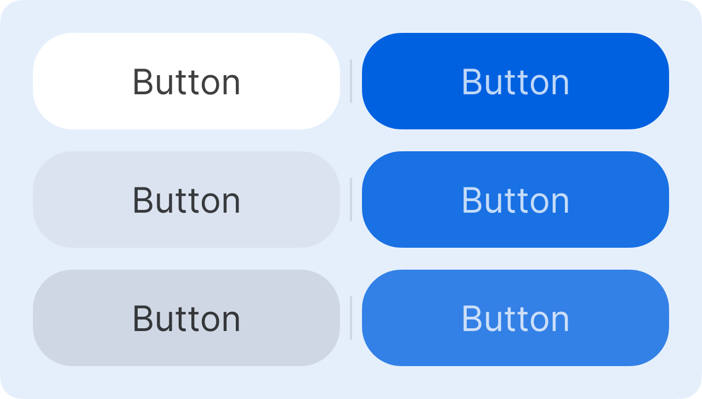

# Buttons

Used for giving users a way to trigger a action.

They're usually varying in width but are 40px tall with one line of text and sometimes taller with more lines.

## Visual Previews

Normal Button

---

Dialog Button

## Styling (Normal)

- **Color**: black in light mode or white in dark mode, 0% alpha by default with white background, 5% alpha for hover, and 10% alpha on press

- **Padding**: 15px wide, 10px tall

- **Size**: 100% available content width (Custom is fine), 40px tall minimum

- **Gap Size**: 10px off other buttons and a horizontal separator between gaps thats 20px in height

