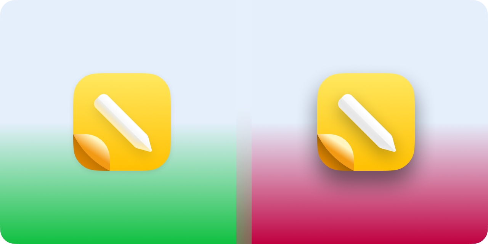
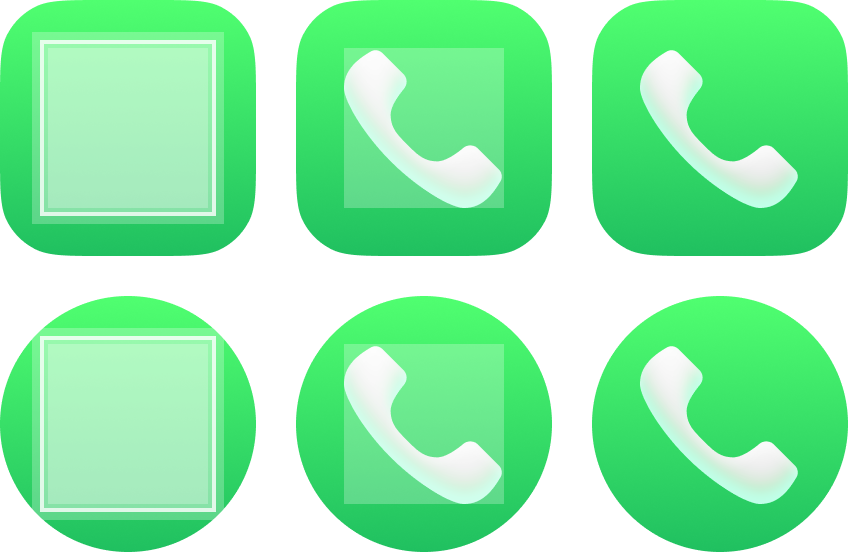

# Iconography

Helpful to guide you on how to design your app's iconography in a fitting style to Orchid Experience.

## Refrence App Icons

| Icon | App Name | ID |
|---|---|---|
|  | Browser | org.orchid.browser |
|  | Calculator | org.orchid.calculator |
|  | Contacts | org.orchid.contacts |
|  | Phone | org.orchid.dialer |
|  | Notes | org.orchid.notes |
|  | Messages | org.orchid.sms |

## Visual Previews

Example preview of how shading should resemble

## How To Do a DuoTone Icon?

Orchid accented DuoTone app icons are made out of 2 parts, mask and symbol icon

The textures making out a DuoTone icon are in this example form with white allowing software to tint and tweak the visual color:

---

In OrchidOS. Those textures will form a single icon accented in #EDA46F  as a example accent like this:

## Styling (Normal)

- **Padding**: from 18px to 22px based on context with it allowed as even numbers only to avoid too much anti-aliasing on lower resolutions. So it works in circular shape like the following\

